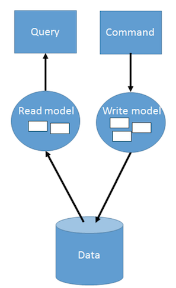

# CQRS with Axon

By Gerard de Leeuw and Teije van Sloten

--
## Goal

__Inform you about the *What*, *Why* and *How* of CQRS and Event Sourcing__

--
## We will discuss the following subjects

- What is CQRS?
  - What/Why/When
- What is Event Sourcing?
  - What/Why/When
- Example code using Axon

---
# What is CQRS?

--

__Command Query Responsibility Segregation__

--

--

## Origin

Bertrand Meyer’s Command and Query Separation Principle for Eiffel (1985)

`
It states that every method should either be a command that performs an action,
or a query that returns data to the caller, but not both.
In other words, asking a question should not change the answer.
More formally, methods should return a value only if they are referentially transparent and hence possess no side effects.
`
--

# Why?

As an application matures it gets multiple representations of data.

Those representations have different meanings for each stakeholder.

--

### Example: Flight

The representation of a flight is different for:
 - Pilot
 - Passenger
 - Airport
 - etc...

--

## Seperating the actions and queries into different models removes the complexity of maintaining a model that can do everything.

--

# Why?

Recilience/Performance

--

### Example: Selling tickets

--

# Why not?

- Extra complexity (!)
- Not many data representations are needed

-> It is not a Silver bullet

--

### Some Frameworks:

 - [CQRSlite       -C#](https://github.com/gautema/CQRSlite)
 - [NCQRS          -.NET](https://github.com/pjvds/ncqrs)
 - [Axon Framework -Java](http://www.axonframework.org/)
 - [Renovo         -Java](http://reveno.org/)

--
# When to use

- Your domain is complex
- High performance needed
  - You can scale the read and write part individually

---
# What is Event Sourcing?

---
# What does the code look like when I use Axon 3.0

---
### info used on SQRS:

- http://martinfowler.com/bliki/CQRS.html
- http://codebetter.com/gregyoung/2010/02/16/cqrs-task-based-uis-event-sourcing-agh/
- http://udidahan.com/2009/12/09/clarified-cqrs/
- https://msdn.microsoft.com/en-us/library/dn568103.aspx
- https://en.wikipedia.org/wiki/Command%E2%80%93query_separation
- http://www.cqrs.nu/
- http://microservices.io/patterns/data/cqrs.html
- https://lostechies.com/gabrielschenker/2015/04/07/cqrs-revisited/
- http://www.codeproject.com/Articles/555855/Introduction-to-CQRS
- https://cqrs.wordpress.com/documents/cqrs-introduction/

--
### info used on event sourcing:

- http://martinfowler.com/eaaDev/EventSourcing.html
- https://msdn.microsoft.com/en-us/library/dn589792.aspx
- http://microservices.io/patterns/data/event-sourcing.html
